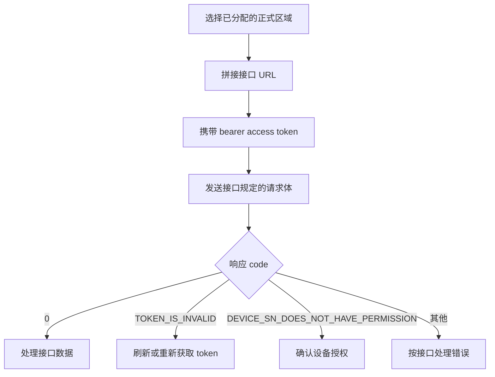
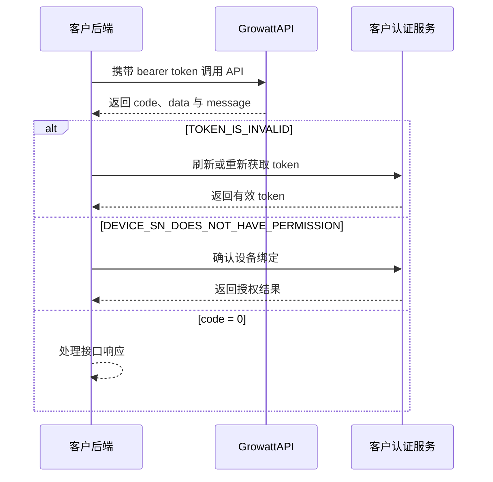

# 全局参数

## 正式环境基础地址

请使用为您的接入区域分配的正式环境基础地址：

- 全球：`https://opencloud.growatt.com`
- 澳洲：`https://opencloud-au.growatt.com`

授权、token 与设备 API 必须使用同一区域。如果无法确定账号所属区域，请在接入前向 Growatt 对接人员确认。

## 请求准备流程



## 权限处理时序



## HTTP 请求头

受保护接口需要 access token。

| 参数 | 是否必填 | 值 |
| :--- | :--- | :--- |
| `Authorization` | 是 | `Bearer <access_token>` |

## 响应结构

### 格式示例

```json
{
    "code": 0,
    "data": "<endpoint-dependent>",
    "message": "RESPONSE_MESSAGE"
}
```

`data` 可能不返回，也可能为 `null`、对象、数组或数值，具体取决于接口与结果。请以 `code` 作为主要成功标志。

| 场景 | `code` | `data` | `message` |
| :--- | :--- | :--- | :--- |
| 操作成功 | `0` | 取决于接口 | `"SUCCESSFUL_OPERATION"` 或接口规定的成功消息 |
| 设备 SN 无权限 | `12` | `["DEVICE_SN_1"]` | `"DEVICE_SN_DOES_NOT_HAVE_PERMISSION"` |
| Token 无效 | `2` | 不返回 | `"TOKEN_IS_INVALID"` |
| 设备离线 | `5` | `null` | `"DEVICE_OFFLINE"` |
| 读取设备参数失败 | `18` | `null` | `"READ_DEVICE_PARAM_FAIL"` |
| 授权模式错误 | `103` | 不返回 | `"WRONG_GRANT_TYPE"` |
| 设置参数响应超时 | `16` | `null` | `"PARAMETER_SETTING_RESPONSE_TIMEOUT"` |
| 设置参数时设备无响应 | `15` | `null` | `"PARAMETER_SETTING_DEVICE_NOT_RESPONDING"` |
| 设置参数失败 | `6` | `null` | `"PARAMETER_SETTING_FAILED"` |
| 请求过于频繁 | `105` | `null` | `"TOO_MANY_REQUEST"` |

## 设备调度参数

| `setType` | 说明 | `value` 格式 |
| :--- | :--- | :--- |
| `time_slot_charge_discharge` | 分时段充放电。`percentage` 范围 `[-100,100]`，正值充电、负值放电；时间使用 UTC，最多可设置 16 个时段 | `[{ "percentage": 100, "startTime": "00:00", "endTime": "23:59" }]` |
| `duration_and_power_charge_discharge` | 按时长与功率百分比充放电；`duration`、`percentage`、`type` 字段取值见下文 | `{ "duration": 10, "percentage": 20, "type": "dischargeCommand" }` |
| `export_limit` | Export Limit。`exportLimitEnabled` 用于启用设置；`percentage` 范围 `[-100,100]`，正值表示逆流限制，负值表示顺流控制 | `{ "exportLimitEnabled": 1, "percentage": 20 }` |
| `enable_control` | 启用或关闭 VPP 控制 | `1` = 开启，`0` = 关闭 |
| `active_power_derating_percentage` | 有功功率降额百分比 | `[0,100]` 范围的数值，例如 `50` |
| `active_power_percentage` | 有功功率百分比 | `[0,100]` 范围的数值，例如 `60` |
| `remote_charge_discharge_power` | 远程充放电功率 | `[-100,100]` 范围的数值，正值充电、负值放电 |

### `duration_and_power_charge_discharge` 字段说明

| 字段 | 类型 | 说明 |
| :--- | :--- | :--- |
| `duration` | int | 持续时长（分钟）。`0` 表示不限时，`1~1440` 分钟按设定时长控制 |
| `percentage` | int | 基于电池额定充放电功率的百分比，范围 `[-100,100]`，正值充电、负值放电 |
| `type` | string | 指令类型：`selfConsumptionCommand`、`chargeOnlySelfConsumptionCommand`、`chargeCommand`、`dischargeCommand` |

**`type` 指令类型说明：**

| 指令类型 | 说明 | 功率控制 |
| :--- | :--- | :--- |
| `selfConsumptionCommand` | 自发自用模式，自动充放电。光伏优先供负载，余量给电池充电；不足时电池放电或从电网取电补充。 | 充放电功率由系统自动控制（最大功率），`percentage` 参数无效 |
| `chargeOnlySelfConsumptionCommand` | 该模式类似于自发自用，区别在于，电池只能从光伏取电而不能从电网取电。光伏充足时：光伏先满足负载，多余电量给电池充电。光伏不足时：电池不充不放，负载从市电取电。 | 充电功率由系统自动控制（最大功率），`percentage` 参数无效 |
| `chargeCommand` | 强制以指定功率充电。电池从可用电源（光伏和/或市电）以指定功率充电。 | 遵循 `percentage` 设定 |
| `dischargeCommand` | 强制以指定功率放电。电池以指定功率放电，供给负载或向电网输出。 | 遵循 `percentage` 设定 |

## 各 `setType` 的回读结构

以下每个请求都必须使用实际已授权的设备 SN，并生成新的唯一 32 位 `requestId`。

| `setType` | 请求示例 | `readDeviceDispatch.data` 示例 | 结构 |
| :--- | :--- | :--- | :--- |
| `time_slot_charge_discharge` | `{ "deviceSn": "DEVICE_SN_1", "requestId": "20260115093000123abcdef123456789", "setType": "time_slot_charge_discharge" }` | `[{ "startTime": "16:00", "endTime": "18:00", "percentage": 80 }]` | 数组 |
| `duration_and_power_charge_discharge` | `{ "deviceSn": "DEVICE_SN_1", "requestId": "20260115093000123abcdef123456790", "setType": "duration_and_power_charge_discharge" }` | `{ "remotePowerControlEnable": 1, "duration": 10, "percentage": 80, "acChargingEnabled": 1 }` | 对象 |
| `export_limit` | `{ "deviceSn": "DEVICE_SN_1", "requestId": "20260115093000123abcdef123456791", "setType": "export_limit" }` | `{ "exportLimitEnabled": 1, "percentage": 20 }` | 对象 |
| `enable_control` | `{ "deviceSn": "DEVICE_SN_1", "requestId": "20260115093000123abcdef123456792", "setType": "enable_control" }` | `1` | 数值 |
| `active_power_derating_percentage` | `{ "deviceSn": "DEVICE_SN_1", "requestId": "20260115093000123abcdef123456793", "setType": "active_power_derating_percentage" }` | `50` | 数值 |
| `active_power_percentage` | `{ "deviceSn": "DEVICE_SN_1", "requestId": "20260115093000123abcdef123456794", "setType": "active_power_percentage" }` | `60` | 数值 |
| `remote_charge_discharge_power` | `{ "deviceSn": "DEVICE_SN_1", "requestId": "20260115093000123abcdef123456795", "setType": "remote_charge_discharge_power" }` | `-30` | 数值 |

## 相关文档

- [设备调度 API](./05_api_device_dispatch.md)
- [读取设备调度参数 API](./06_api_read_dispatch.md)
- [常见问题与排查](./11_api_troubleshooting.md)
