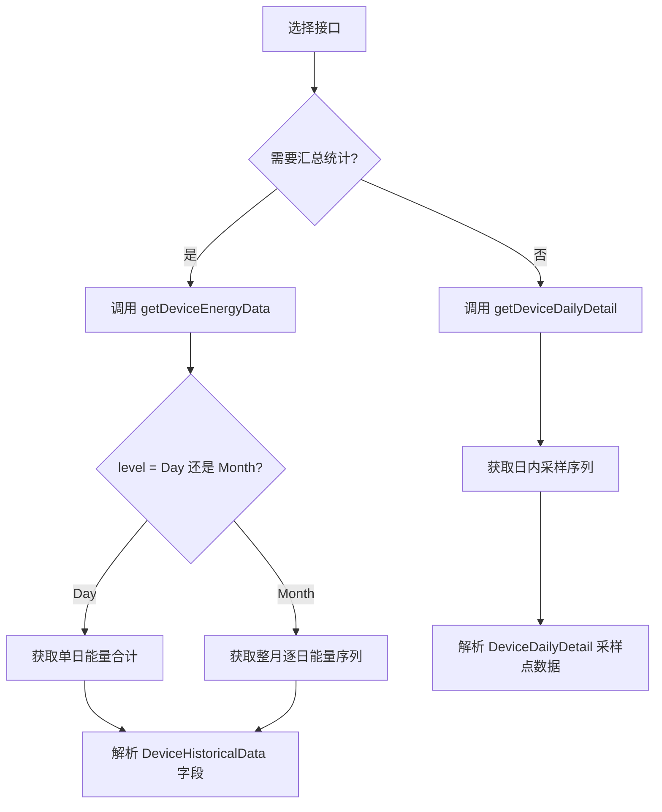

# 历史数据查询 API

## 接口说明

- 通过设备序列号查询设备的历史能量统计数据和详细采样数据
- 接口仅返回当前 token 有权访问的设备结果；未授权设备返回 `DEVICE_SN_DOES_NOT_HAVE_PERMISSION`
- **getDeviceEnergyData** — 按日/月查询发电量统计
- **getDeviceDailyDetail** — 按日查询明细采样序列
- 历史数据查询频率限制：`1 次/分钟/设备`

## 历史数据查询流程



---

## 1. getDeviceEnergyData — 按日/月查询发电量统计

按日或按月查询设备能量统计数据。

### 请求 URL

- `/oauth2/getDeviceEnergyData`

### 请求方法

- `POST`
- `Content-Type: application/json`
- `Authorization: Bearer <token>`

### HTTP Body 参数

| 参数 | 必填 | 类型 | 说明 | 示例 |
| :--- | :--- | :--- | :--- | :--- |
| `deviceSn` | 是 | string | 设备序列号 | `"DEVICE_SN_1"` |
| `level` | 是 | string | 汇总粒度：`Day` 或 `Month` | `"Month"` |
| `date` | 是 | string | 日期，格式 `yyyy-MM-dd` | `"2026-07-15"` |

**level 说明：**

| level | 返回内容 | date 要求 | 说明 |
| :--- | :--- | :--- | :--- |
| `Day` | 单日数据 | 必填 | 返回指定日期当天的能量合计 |
| `Month` | 整月逐日序列 | 必填 | 返回指定日期所在月份的整月逐日能量序列 |

### 请求示例

#### 示例 1：查询整月统计

```json
{
    "deviceSn": "DEVICE_SN_1",
    "level": "Month",
    "date": "2026-07-15"
}
```

#### 示例 2：查询单日统计

```json
{
    "deviceSn": "DEVICE_SN_1",
    "level": "Day",
    "date": "2026-07-01"
}
```

### 响应结构（DeviceHistoricalData）

```json
{
    "code": 0,
    "msg": "success",
    "data": {
        "deviceSn": "DEVICE_SN_1",
        "list": [
            {
                "date": "2026-07-01",
                "epv": 30.13,
                "etoUser": 5.2,
                "etoGrid": 2.0,
                "echarge": 8.0,
                "edischarge": 7.9
            },
            {
                "date": "2026-07-02",
                "epv": 32.4,
                "etoUser": 4.2,
                "etoGrid": 2.6,
                "echarge": 9.3,
                "edischarge": 8.3
            }
        ]
    }
}
```

### 响应字段定义

| 字段 | 类型 | 单位 | 说明 |
| :--- | :--- | :--- | :--- |
| `code` | int | - | API 状态码；`0` 表示成功 |
| `msg` | string | - | 响应信息 |
| `data` | object | - | 主数据对象 |
| `data.deviceSn` | string | - | 设备序列号 |
| `data.list` | array | - | 每日能量记录数组 |
| `data.list[].date` | string | - | 日期，格式 `YYYY-MM-DD` |
| `data.list[].epv` | double | kWh | 当日 PV 发电量（对应 `epvToday`） |
| `data.list[].etoUser` | double | kWh | 当日电网取电量（对应 `etoUserToday`） |
| `data.list[].etoGrid` | double | kWh | 当日电网送电量（对应 `etoGridToday`） |
| `data.list[].echarge` | double | kWh | 当日电池充电量（对应 `echargeToday`） |
| `data.list[].edischarge` | double | kWh | 当日电池放电量（对应 `edischargeToday`） |

**能量字段映射：**

| 历史字段 | 对应实时字段 | 说明 |
| :--- | :--- | :--- |
| `epv` | `epvToday` | PV 发电 |
| `etoUser` | `etoUserToday` | 电网取电 |
| `etoGrid` | `etoGridToday` | 电网送电 |
| `echarge` | `echargeToday` | 电池充电 |
| `edischarge` | `edischargeToday` | 电池放电 |

---

## 2. getDeviceDailyDetail — 按日查询明细采样序列

查询某一天的日内采样序列。

### 请求 URL

- `/oauth2/getDeviceDailyDetail`

### 请求方法

- `POST`
- `Content-Type: application/json`
- `Authorization: Bearer <token>`

### HTTP Body 参数

| 参数 | 必填 | 类型 | 说明 | 示例 |
| :--- | :--- | :--- | :--- | :--- |
| `deviceSn` | 是 | string | 设备序列号 | `"DEVICE_SN_1"` |
| `date` | 是 | string | 日期，格式 `yyyy-MM-dd` | `"2026-08-19"` |

### 请求示例

#### 示例：查询每日明细

```json
{
    "deviceSn": "DEVICE_SN_1",
    "date": "2026-08-19"
}
```

### 响应结构（DeviceDailyDetail）

```json
{
    "code": 0,
    "msg": "success",
    "data": {
        "deviceSn": "DEVICE_SN_1",
        "list": [
            {
                "utcTime": "2026-08-19 03:19:09",
                "ppv": 0.0,
                "pac": 0.0,
                "payLoadPower": 510.0,
                "batPower": -510.0,
                "soc": 87,
                "status": 8,
                "batteryStatus": 3,
                "priority": 0,
                "faultCode": 0,
                "faultSubCode": 0,
                "protectCode": 0,
                "protectSubCode": 0,
                "reactivePower": 0.0,
                "fac": 0.0,
                "meterPower": 0.0,
                "etoUserToday": 7.0,
                "etoUserTotal": 473.9,
                "etoGridToday": 0.0,
                "etoGridTotal": 668.2,
                "epvTotal": 155.8,
                "epvToday": 0.0,
                "pexPower": 0.0,
                "vac1": 0.0,
                "vac2": 0.0,
                "vac3": 0.0,
                "maxChargePower": 6000,
                "maxDischargePower": 6000,
                "batteryList": [...]
            }
        ]
    }
}
```

### 响应字段定义

每日明细返回与[设备数据 API](./08_api_device_data.md) 相同的遥测字段，每条记录代表一个采样点。主要字段包括：

| 字段 | 类型 | 单位 | 说明 |
| :--- | :--- | :--- | :--- |
| `data.list[].utcTime` | string | - | 采样时间戳（UTC） |
| `data.list[].ppv` | double | W | PV 功率 |
| `data.list[].pac` | double | W | AC 输出功率 |
| `data.list[].batPower` | double | W | 电池功率（正值 = 充电，负值 = 放电） |
| `data.list[].soc` | int | % | 电池电量百分比 |
| `data.list[].batteryList` | array | - | 电池组详情 |

完整字段定义请参考[设备数据 API](./08_api_device_data.md)。

## 相关参考

- [设备数据 API](./08_api_device_data.md) - 实时遥测数据查询
- [设备数据推送](./09_api_device_push.md) - Webhook 推送机制
- [设备信息 API](./07_api_device_info.md) - 获取站点时区和元数据
- [全局参数](./10_global_params.md) - 基础 URL 和响应代码
