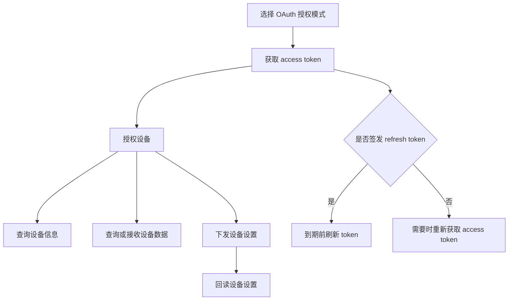
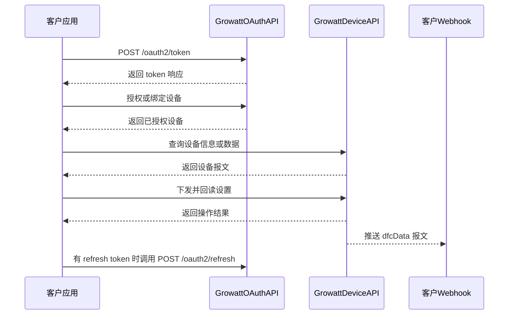

# Growatt Open API 文档

本套文档用于帮助您完成应用认证、设备授权、设备信息与遥测查询、调度下发与回读，以及设备数据推送接收。

## 集成路线图

## 典型请求顺序

## API 指南

| 指南 | 用途 |
| :--- | :--- |
| [身份认证](./01_authentication.md) | 选择授权模式并了解 token 行为 |
| [获取 access token](./02_api_access_token.md) | 申请 `access_token` |
| [刷新 token](./03_api_refresh.md) | 更新即将到期的 token 对 |
| [设备授权](./04_api_device_auth.md) | 查询、绑定、查看和解除授权设备 |
| [设备调度](./05_api_device_dispatch.md) | 下发设备设置命令 |
| [读取调度设置](./06_api_read_dispatch.md) | 回读设备设置值 |
| [设备信息](./07_api_device_info.md) | 查询设备标识、能力与站点信息 |
| [设备数据](./08_api_device_data.md) | 查询设备遥测数据 |
| [设备数据推送](./09_api_device_push.md) | 接收 `dfcData` Webhook 报文 |
| [全局参数](./10_global_params.md) | 查看基础地址、请求头、返回码和 `setType` |
| [常见问题与排查](./11_api_troubleshooting.md) | 处理常见接入问题 |

## 关键集成规则

- 通过 `Authorization: Bearer <access_token>` 传递访问令牌。
- `client_secret`、access token 和 refresh token 仅保存在可信后端，不得暴露在浏览器或移动端代码中。
- token 请求应携带 `redirect_uri`，并与为客户端登记的回调地址保持一致。
- 终端用户授权设备时使用 `authorization_code`；`getDeviceList` 仅支持该模式。
- `client_credentials` 模式调用 `bindDevice` 时，必须携带 `deviceSnList[].pinCode`。
- 调度下发和调度回读请求均应将 `requestId` 作为必填字段。
- 每次都从响应读取 token 有效期，不要固化示例中的数值。
- 通过 `code` 判断接口是否成功；`data` 的结构会随接口和 `setType` 变化。

## 开始集成

- [快速指南](/growatt-openapi/quick-guide)
- [版本说明](/growatt-openapi/release-notes)
- [身份认证](./01_authentication.md)
- [常见问题与排查](./11_api_troubleshooting.md)

## 附录

- [附录 A Growatt Codes](/growatt-openapi/growatt-codes)
- [附录 B 术语表](./13_ess_terminology.md)
- [附录 C 语义模型](./14_ess_semantic_model.md)
- [附录 D 产品兼容性](./15_appendix_d_openapi_support_scope.md)
- [附录 E API 频率限制](./16_api_rate_limiting.md)
