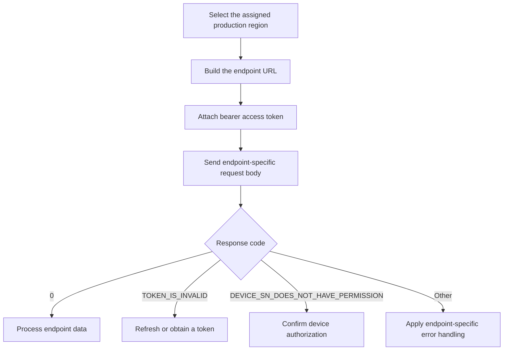
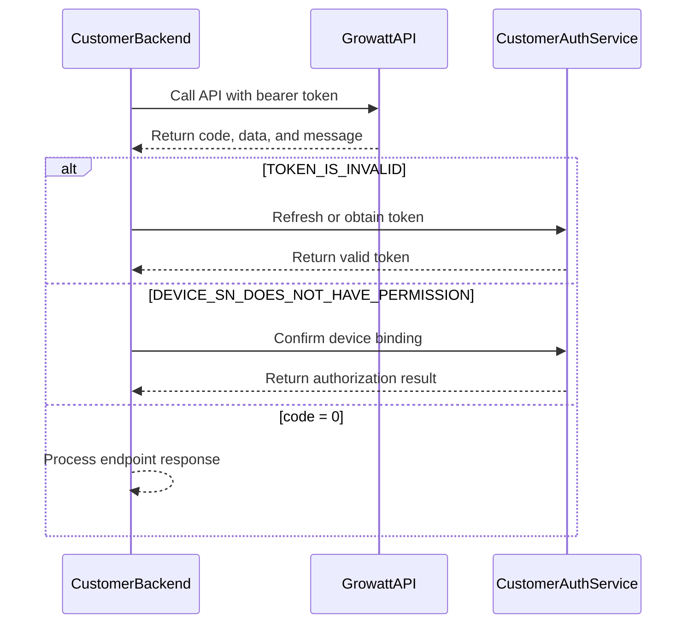

# Global Parameters

## Production Base URLs

Use the production base URL assigned to your integration region:

- Global: `https://opencloud.growatt.com`
- Australia: `https://opencloud-au.growatt.com`

Use the same region for authorization, token, and device API calls. If you are unsure which region applies to your account, confirm it with your Growatt representative before integration.

## Request Preparation Flow



## Permission Handling Sequence



## HTTP Header

Protected endpoints require an access token.

| Parameter | Required | Value |
| :--- | :--- | :--- |
| `Authorization` | Yes | `Bearer <access_token>` |

## Response Envelope

### Format Example

```json
{
    "code": 0,
    "data": "<endpoint-dependent>",
    "message": "RESPONSE_MESSAGE"
}
```

`data` may be absent, `null`, an object, an array, or a number depending on the endpoint and result. Use `code` as the primary success indicator.

| Scenario | `code` | `data` | `message` |
| :--- | :--- | :--- | :--- |
| Successful operation | `0` | Endpoint-dependent | `"SUCCESSFUL_OPERATION"` or the endpoint-specific success message |
| Device SN does not have permission | `12` | `["DEVICE_SN_1"]` | `"DEVICE_SN_DOES_NOT_HAVE_PERMISSION"` |
| Token is invalid | `2` | Not returned | `"TOKEN_IS_INVALID"` |
| Device offline | `5` | `null` | `"DEVICE_OFFLINE"` |
| Read device parameter failed | `18` | `null` | `"READ_DEVICE_PARAM_FAIL"` |
| Wrong grant type | `103` | Not returned | `"WRONG_GRANT_TYPE"` |
| Parameter-setting response timeout | `16` | `null` | `"PARAMETER_SETTING_RESPONSE_TIMEOUT"` |
| Parameter-setting device not responding | `15` | `null` | `"PARAMETER_SETTING_DEVICE_NOT_RESPONDING"` |
| Parameter-setting failed | `6` | `null` | `"PARAMETER_SETTING_FAILED"` |
| Too many requests | `105` | `null` | `"TOO_MANY_REQUEST"` |

## Device Dispatch Parameters

| `setType` | Description | `value` format |
| :--- | :--- | :--- |
| `time_slot_charge_discharge` | Time-slot charging/discharging. `percentage` range `[-100,100]`; positive means charging and negative means discharging. Times use UTC, and up to 16 slots may be configured | `[{ "percentage": 100, "startTime": "00:00", "endTime": "23:59" }]` |
| `duration_and_power_charge_discharge` | Charge/discharge by duration and power percentage; see below for the `duration`, `percentage`, and `type` field values | `{ "duration": 10, "percentage": 20, "type": "dischargeCommand" }` |
| `export_limit` | Export Limit. `exportLimitEnabled` enables the setting; `percentage` range is `[-100,100]`. Positive values apply export limiting and negative values apply forward-flow control | `{ "exportLimitEnabled": 1, "percentage": 20 }` |
| `enable_control` | Enables or disables VPP control | `1` = enable, `0` = disable |
| `active_power_derating_percentage` | Active-power derating percentage | Number in `[0,100]`, for example `50` |
| `active_power_percentage` | Active-power percentage | Number in `[0,100]`, for example `60` |
| `remote_charge_discharge_power` | Remote charge/discharge power | Number in `[-100,100]`; positive means charging and negative means discharging |

### `duration_and_power_charge_discharge` Field Values

| Field | Type | Description |
| :--- | :--- | :--- |
| `duration` | int | Duration in minutes. `0` means unlimited; `1~1440` minutes controls by the set duration |
| `percentage` | int | Percentage of rated battery charge/discharge power, range `[-100,100]`; positive means charging and negative means discharging |
| `type` | string | Command type: `selfConsumptionCommand`, `chargeOnlySelfConsumptionCommand`, `chargeCommand`, or `dischargeCommand` |

**`type` Command Type Descriptions:**

| Command Type | Description | Power Control |
| :--- | :--- | :--- |
| `selfConsumptionCommand` | Self-consumption mode with automatic charge/discharge. PV powers loads first; surplus charges battery; shortfall is met by discharging battery or grid import. | Charge/discharge power is automatically controlled by the system (max power); `percentage` parameter is ignored |
| `chargeOnlySelfConsumptionCommand` | Similar to self-consumption mode, but battery can only charge from PV, not from grid. When PV is sufficient: PV powers loads first, surplus charges battery. When PV is insufficient: battery remains idle (no charging or discharging), loads draw from grid. | Charge power is automatically controlled by the system (max power); `percentage` parameter is ignored |
| `chargeCommand` | Forced charging at specified power. Battery charges from available sources (PV and/or grid) at the commanded rate. | Respects `percentage` setting |
| `dischargeCommand` | Forced discharging at specified power. Battery discharges at the commanded rate to supply loads or export to grid. | Respects `percentage` setting |

## Read-Back Shapes by `setType`

Every request below must use the actual authorized device SN and a new unique 32-character `requestId`.

| `setType` | Request example | `readDeviceDispatch.data` example | Shape |
| :--- | :--- | :--- | :--- |
| `time_slot_charge_discharge` | `{ "deviceSn": "DEVICE_SN_1", "requestId": "20260115093000123abcdef123456789", "setType": "time_slot_charge_discharge" }` | `[{ "startTime": "16:00", "endTime": "18:00", "percentage": 80 }]` | Array |
| `duration_and_power_charge_discharge` | `{ "deviceSn": "DEVICE_SN_1", "requestId": "20260115093000123abcdef123456790", "setType": "duration_and_power_charge_discharge" }` | `{ "remotePowerControlEnable": 1, "duration": 10, "percentage": 80, "acChargingEnabled": 1 }` | Object |
| `export_limit` | `{ "deviceSn": "DEVICE_SN_1", "requestId": "20260115093000123abcdef123456791", "setType": "export_limit" }` | `{ "exportLimitEnabled": 1, "percentage": 20 }` | Object |
| `enable_control` | `{ "deviceSn": "DEVICE_SN_1", "requestId": "20260115093000123abcdef123456792", "setType": "enable_control" }` | `1` | Number |
| `active_power_derating_percentage` | `{ "deviceSn": "DEVICE_SN_1", "requestId": "20260115093000123abcdef123456793", "setType": "active_power_derating_percentage" }` | `50` | Number |
| `active_power_percentage` | `{ "deviceSn": "DEVICE_SN_1", "requestId": "20260115093000123abcdef123456794", "setType": "active_power_percentage" }` | `60` | Number |
| `remote_charge_discharge_power` | `{ "deviceSn": "DEVICE_SN_1", "requestId": "20260115093000123abcdef123456795", "setType": "remote_charge_discharge_power" }` | `-30` | Number |

## Related Documentation

- [Device Dispatch API](./05_api_device_dispatch.md)
- [Read Device Dispatch Parameters API](./06_api_read_dispatch.md)
- [Troubleshooting FAQ](./11_api_troubleshooting.md)
