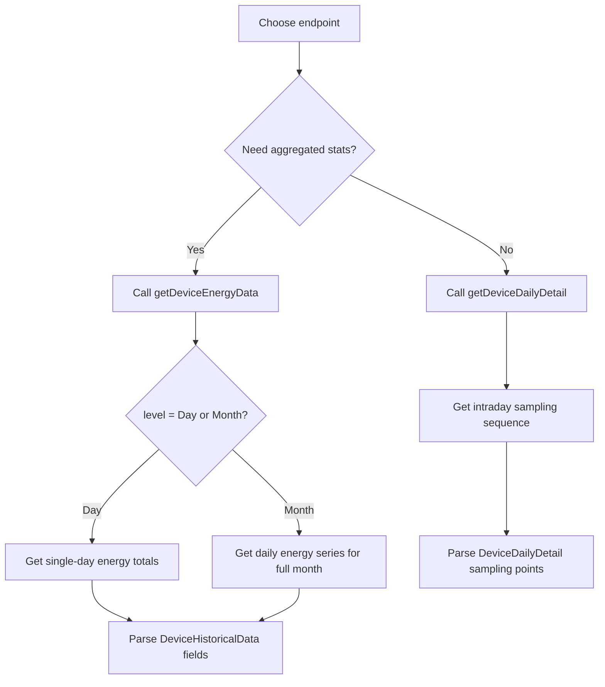

# Historical Data Query API

## Brief Description

- Query historical energy statistics and detailed sampling data for a device by device serial number.
- The API returns only device results that the current token is allowed to access; unauthorized devices return `DEVICE_SN_DOES_NOT_HAVE_PERMISSION`.
- **getDeviceEnergyData** — Query daily or monthly aggregated energy statistics
- **getDeviceDailyDetail** — Query intraday sampling sequence
- Maximum historical data request rate: `1 request / min / device`.

## Historical Data Consumption Flow



---

## 1. getDeviceEnergyData — Daily / Monthly Energy Statistics

Query daily or monthly aggregated energy statistics.

### Request URL

- `/oauth2/getDeviceEnergyData`

### Request Method

- `POST`
- `Content-Type: application/json`
- `Authorization: Bearer <token>`

### HTTP Body Parameters

| Parameter | Required | Type | Description | Example |
| :--- | :--- | :--- | :--- | :--- |
| `deviceSn` | Yes | string | Unique device serial number | `"DEVICE_SN_1"` |
| `level` | Yes | string | Aggregation level: `Day` or `Month` | `"Month"` |
| `date` | Yes | string | Date in `yyyy-MM-dd` format | `"2026-07-15"` |

**Level Description:**

| level | Returns | date requirement | Description |
| :--- | :--- | :--- | :--- |
| `Day` | Single day | Required | Returns energy totals for the specified date |
| `Month` | Full month daily series | Required | Returns daily energy totals for the entire month containing the specified date |

### Request Examples

#### Example 1: Query Monthly Statistics

```json
{
    "deviceSn": "DEVICE_SN_1",
    "level": "Month",
    "date": "2026-07-15"
}
```

#### Example 2: Query Single Day Statistics

```json
{
    "deviceSn": "DEVICE_SN_1",
    "level": "Day",
    "date": "2026-07-01"
}
```

### Response Structure (DeviceHistoricalData)

```json
{
    "code": 0,
    "msg": "success",
    "data": {
        "deviceSn": "DEVICE_SN_1",
        "list": [
            {
                "date": "2026-07-01",
                "epv": 30.13,
                "etoUser": 5.2,
                "etoGrid": 2.0,
                "echarge": 8.0,
                "edischarge": 7.9
            },
            {
                "date": "2026-07-02",
                "epv": 32.4,
                "etoUser": 4.2,
                "etoGrid": 2.6,
                "echarge": 9.3,
                "edischarge": 8.3
            }
        ]
    }
}
```

### Response Field Definitions

| Field | Type | Unit | Description |
| :--- | :--- | :--- | :--- |
| `code` | int | - | API status code; `0` means success |
| `msg` | string | - | Response message |
| `data` | object | - | Main data object |
| `data.deviceSn` | string | - | Device serial number |
| `data.list` | array | - | Array of daily energy records |
| `data.list[].date` | string | - | Date in `YYYY-MM-DD` format |
| `data.list[].epv` | double | kWh | Daily PV generation (corresponds to `epvToday`) |
| `data.list[].etoUser` | double | kWh | Daily energy imported from grid (corresponds to `etoUserToday`) |
| `data.list[].etoGrid` | double | kWh | Daily energy exported to grid (corresponds to `etoGridToday`) |
| `data.list[].echarge` | double | kWh | Daily battery charge energy (corresponds to `echargeToday`) |
| `data.list[].edischarge` | double | kWh | Daily battery discharge energy (corresponds to `edischargeToday`) |

**Energy Field Mapping:**

| Historical Field | Corresponding Real-time Field | Description |
| :--- | :--- | :--- |
| `epv` | `epvToday` | PV generation |
| `etoUser` | `etoUserToday` | Grid import |
| `etoGrid` | `etoGridToday` | Grid export |
| `echarge` | `echargeToday` | Battery charge |
| `edischarge` | `edischargeToday` | Battery discharge |

---

## 2. getDeviceDailyDetail — Intraday Sampling Detail

Query intraday sampling sequence for a single day.

### Request URL

- `/oauth2/getDeviceDailyDetail`

### Request Method

- `POST`
- `Content-Type: application/json`
- `Authorization: Bearer <token>`

### HTTP Body Parameters

| Parameter | Required | Type | Description | Example |
| :--- | :--- | :--- | :--- | :--- |
| `deviceSn` | Yes | string | Unique device serial number | `"DEVICE_SN_1"` |
| `date` | Yes | string | Date in `yyyy-MM-dd` format | `"2026-08-19"` |

### Request Examples

#### Example: Query Daily Detail

```json
{
    "deviceSn": "DEVICE_SN_1",
    "date": "2026-08-19"
}
```

### Response Structure (DeviceDailyDetail)

```json
{
    "code": 0,
    "msg": "success",
    "data": {
        "deviceSn": "DEVICE_SN_1",
        "list": [
            {
                "utcTime": "2026-08-19 03:19:09",
                "ppv": 0.0,
                "pac": 0.0,
                "payLoadPower": 510.0,
                "batPower": -510.0,
                "soc": 87,
                "status": 8,
                "batteryStatus": 3,
                "priority": 0,
                "faultCode": 0,
                "faultSubCode": 0,
                "protectCode": 0,
                "protectSubCode": 0,
                "reactivePower": 0.0,
                "fac": 0.0,
                "meterPower": 0.0,
                "etoUserToday": 7.0,
                "etoUserTotal": 473.9,
                "etoGridToday": 0.0,
                "etoGridTotal": 668.2,
                "epvTotal": 155.8,
                "epvToday": 0.0,
                "pexPower": 0.0,
                "vac1": 0.0,
                "vac2": 0.0,
                "vac3": 0.0,
                "maxChargePower": 6000,
                "maxDischargePower": 6000,
                "batteryList": [...]
            }
        ]
    }
}
```

### Response Field Definitions

Daily detail returns the same telemetry fields as [Device Data API](./08_api_device_data.md), with each record representing a single sampling point. Key fields include:

| Field | Type | Unit | Description |
| :--- | :--- | :--- | :--- |
| `data.list[].utcTime` | string | - | Sampling timestamp in UTC |
| `data.list[].ppv` | double | W | PV power |
| `data.list[].pac` | double | W | AC output power |
| `data.list[].batPower` | double | W | Battery power (positive = charge, negative = discharge) |
| `data.list[].soc` | int | % | Battery state of charge |
| `data.list[].batteryList` | array | - | Battery pack details |

For complete field definitions, refer to [Device Data API](./08_api_device_data.md).

## See Also

- [Device Data API](./08_api_device_data.md) - Real-time telemetry query
- [Device Data Push](./09_api_device_push.md) - Webhook push mechanism
- [Device Information API](./07_api_device_info.md) - Get site timezone and metadata
- [Global Parameters](./10_global_params.md) - Base URLs and response codes
