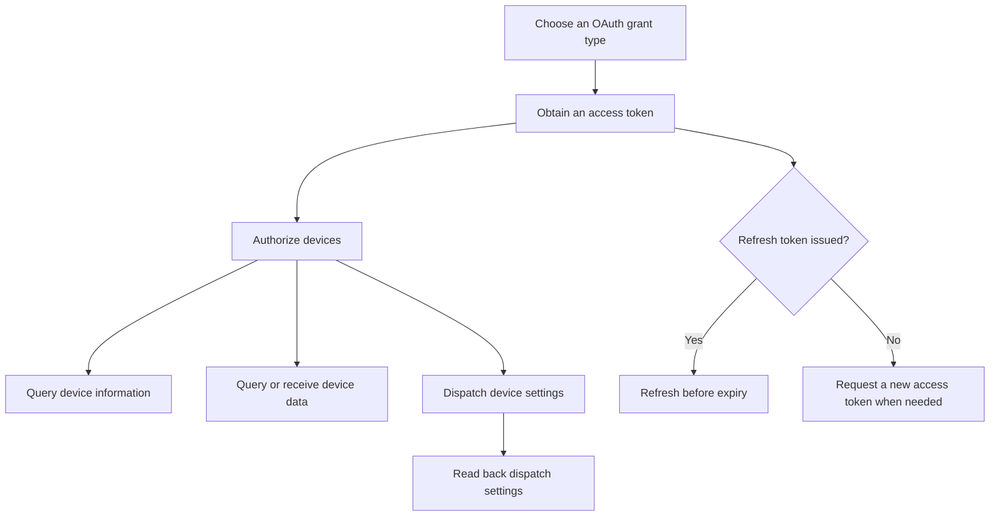
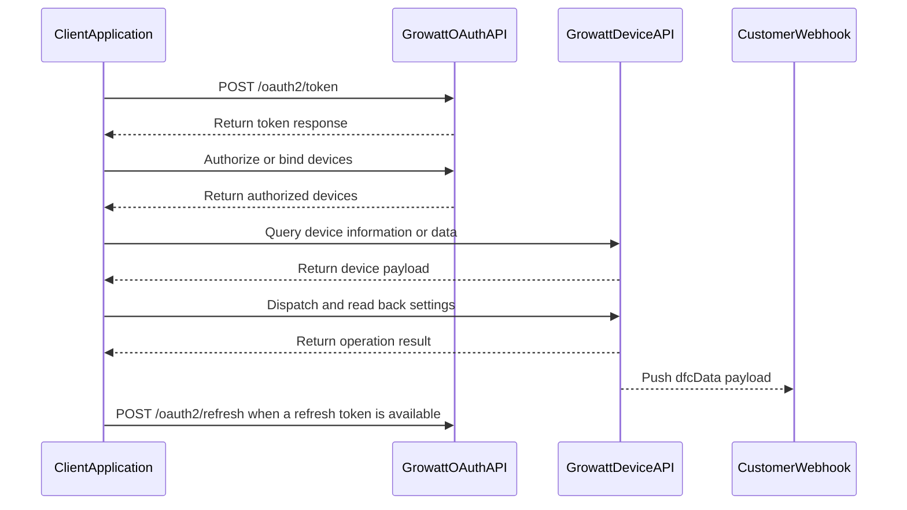

# Growatt Open API Documentation

Use this documentation to authenticate your application, authorize devices, query device information and telemetry, send dispatch commands, read dispatch settings, and receive device-data push messages.

## Integration Roadmap

## Typical Request Sequence

## API Guides

| Guide | Purpose |
| :--- | :--- |
| [Authentication](./01_authentication.md) | Choose a grant type and understand token behavior |
| [Get an access token](./02_api_access_token.md) | Request an `access_token` |
| [Refresh a token](./03_api_refresh.md) | Replace an expiring token pair |
| [Device authorization](./04_api_device_auth.md) | List, bind, review, and unbind authorized devices |
| [Device dispatch](./05_api_device_dispatch.md) | Send device-setting commands |
| [Read dispatch settings](./06_api_read_dispatch.md) | Read back device-setting values |
| [Device information](./07_api_device_info.md) | Query device identity, capability, and site metadata |
| [Device data](./08_api_device_data.md) | Query device telemetry |
| [Device data push](./09_api_device_push.md) | Receive `dfcData` webhook payloads |
| [Global parameters](./10_global_params.md) | Use base URLs, headers, response codes, and `setType` values |
| [Troubleshooting FAQ](./11_api_troubleshooting.md) | Resolve common integration issues |

## Key Integration Rules

- Send access tokens as `Authorization: Bearer <access_token>`.
- Keep `client_secret`, access tokens, and refresh tokens on a trusted backend; never expose them in browser or mobile client code.
- Supply `redirect_uri` in token requests and ensure it matches the callback registered for your client.
- Use `authorization_code` when an end user authorizes devices. `getDeviceList` is available only with this grant type.
- In `client_credentials` mode, include `deviceSnList[].pinCode` when calling `bindDevice`.
- Treat `requestId` as required for both dispatch and dispatch read-back requests.
- Read token lifetime values from each response instead of hard-coding the example values.
- Determine API success from `code`; the shape of `data` varies by endpoint and `setType`.

## Start Here

- [Quick Guide](/growatt-openapi/quick-guide)
- [Release Notes](/growatt-openapi/release-notes)
- [Authentication](./01_authentication.md)
- [Troubleshooting FAQ](./11_api_troubleshooting.md)

## Appendices

- [Appendix A Growatt Codes](/growatt-openapi/growatt-codes)
- [Appendix B Glossary](./13_ess_terminology.md)
- [Appendix C Semantic Model](./14_ess_semantic_model.md)
- [Appendix D Product Compatibility](./15_appendix_d_openapi_support_scope.md)
- [Appendix E API Rate Limiting](./16_api_rate_limiting.md)
